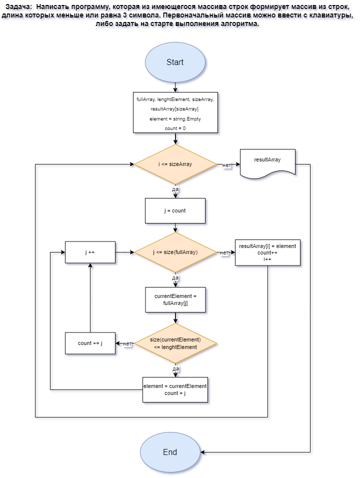

# Задача:

Написать программу, которая из массива строк формирует массив из строк, длина которых меньше либо равна 3 символа. Первоначальный массив можно ввести с клавиатуры, либо задать на старте выполнений алгоритма.

_Примеры:_

> _["hello","2","world",":-)",]->["2",":-)"]_

> _["1234","1567","-2","computer scince"]->["-2"]_

> _["Russia","Denmark","Kazan"]->[ ]_

# Решение:
1. Составляем алгоритм решения задачи 
> * Прилагается к проекту в формате рисунка с расширением .png
2. Создаём код мини-программы (в нашем случае состающую из 4-х функций/методов):
> * Метод определения размера массива, SearchValidSizeArray. В качестве аргументов на вход принимющий первоначальный одномерный массив строк и целочисленное значение количества символов в строках искомого массива. Цикл for считает количество пустых элементов массива, вне цикла определяется число валидных элементов, которые возвращаются из метода целочисленным значением validSizeArray;
> * Метод формирования массива из строк, длина которых меньше либо равна заданному количеству символов GetLimitLengthElementArray. В данном методе используется принцип цикла в цикле, где внутренний цикл фиксирует индекс искомого элемента массива, а внешний - запоняет итоговый массив. На вход метод принимает первоначальный массив, количество символов строк искомого массива и число валидных элементов, найденное предыдущим методом. На выходе возвращается итоговый массив.
> * Метод вывода массива на экран состоит из цикла for и операторов вывода текста и значения объектов в текстовое представление в выходной поток. На вход метод принимает одномерный массив строк. На старте выполнения алгоритма метод использутся дважды: для отображения первоночального и итогового массивов.
> * Метод ввода первоначального массива с клавиатуры предлагает пользователю ввести массив самостоятельно, изначально определившись с его длиной.
3. Создаем текстовое описание решения задачи файлом Readmi c расширением .md

# Алгоритм решения задачи:

